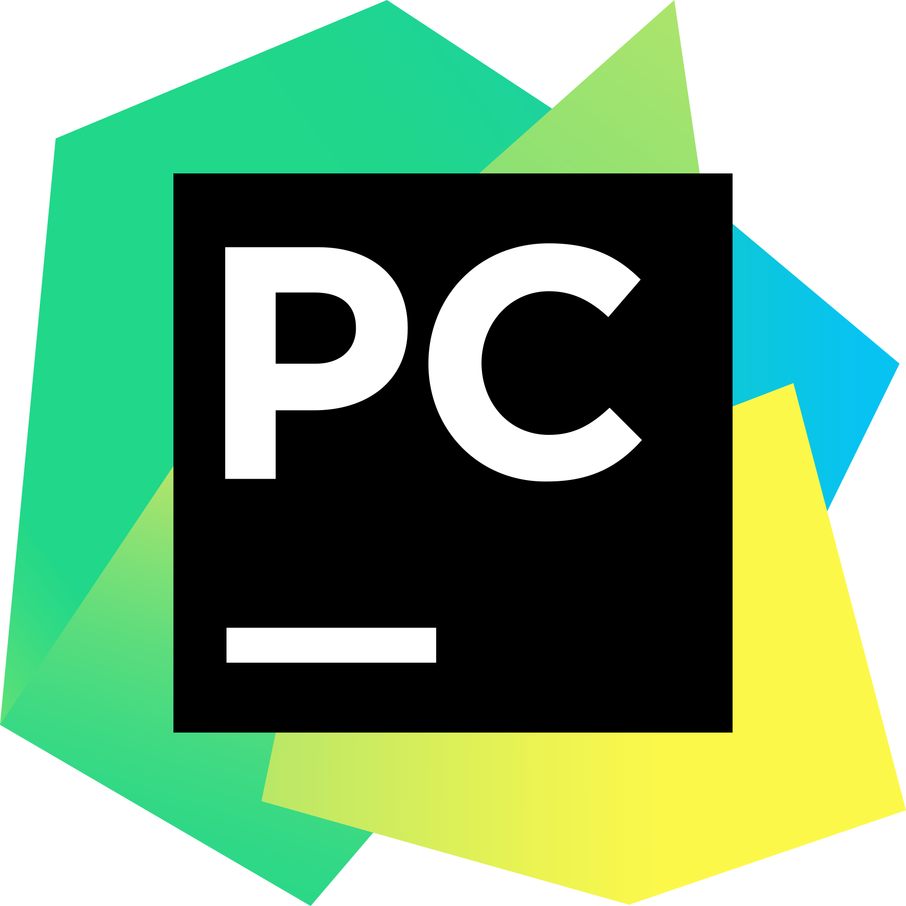

    

    &nbsp;&nbsp;&nbsp;&nbsp;
    &nbsp;&nbsp;&nbsp;&nbsp;
    &nbsp;&nbsp;&nbsp;&nbsp;
    &nbsp;&nbsp;
    

---

## 🔍 Overview
I’m **Muhammad Awais Shaikh**, an enthusiastic AI & Software Engineering student at **Aror University**, passionate about transforming real-world problems into intelligent, impactful software solutions.  
I love working with **Machine Learning**, **Deep Learning**, and **NLP**, and I actively contribute to personal and academic projects on GitHub.

---

### 💻 Tech Stack  
**Languages:**  
       

**Libraries & Frameworks:**  
         

**Tools & Platforms:**  
         

---

## 📊 LeetCode Stats

## 📈 GitHub Stats
 
 
&nbsp;&nbsp;&nbsp;
 
&nbsp;&nbsp;&nbsp;
 

---

### ✍️ Random Dev Quote

---

  
<h2>📕 Projects I've Contributed To</h2>

  

    
  

  

    
  

  
<h2>📌 Pinned</h2>

  
  
  

